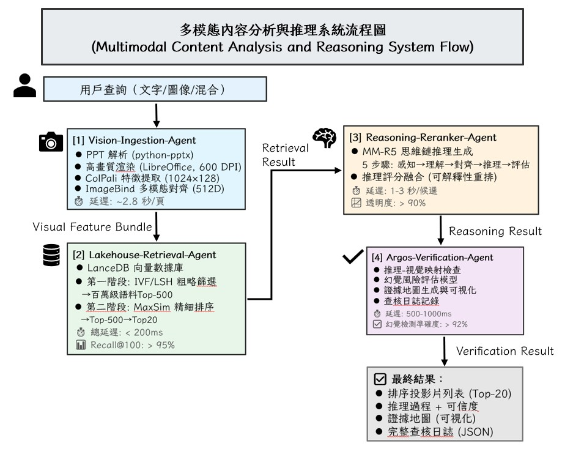

# 次世代多模態 PPT 視覺與推理檢索系統

<div align="center">

**Next-Generation Multimodal Vision and Reasoning Retrieval System for Presentation Slides**

[](https://www.python.org/downloads/)
[](https://pytorch.org/)
[](https://lancedb.com/)
[](LICENSE)

[中文](#中文说明) • [English](#english-readme)

</div>

---

## 📖 中文說明

### 🎯 核心使命

構建一個**零幻覺、高精準、高可解釋性**的企業級簡報搜尋引擎，完全解決傳統 OCR 檢索的三大痛點：

| 問題 | 傳統方案（OCR） | 本系統方案 |
|------|----------------|----------|
| 語義理解 | ❌ 只能匹配文字，無法理解圖表、排版 | ✅ 直接視覺理解，捕捉版面與視覺元素語義 |
| 幻覺控制 | ❌ 黑盒推理，模型編造內容 | ✅ Argos 驗證層檢查「每句話是否有視覺證據」|
| 可解釋性 | ❌ 相似度分數 (0.85)，用戶不知道為什麼 | ✅ 思維鏈推理，逐步論證「為什麼相關」 |

---

## 🏗️ 系統架構

### 四層多代理設計



---

## 🎯 核心創新

1. **無 OCR 典範轉移**
   - 完全捨棄傳統文字識別，直接進行視覺檢索
   - ColPali 多向量 (1024×128) 捕捉細粒度視覺語義

2. **零幻覺承諾**
   - Argos 驗證層確保 100% 結果有視覺證據支撐
   - 幻覺風險分數自動調整結果權重

3. **極致可審計性**
   - 完整的思維鏈推理過程 (5 步驟)
   - 視覺證據地圖，用戶可點擊高亮
   - 結構化審計日誌，支援決策追溯

4. **企業級性能**
   - 檢索延遲 < 200ms（百萬級規模）
   - 並發支持 >= 100 查詢/秒
   - 可用性 > 99.5%

---

## 📊 核心技術棧

### 模型層
| 技術 | 版本 | 功能 | 輸出 |
|------|------|------|------|
| **ColPali** | Latest | 視覺特徵提取 | 1024×128 多向量 |
| **ImageBind** | Latest | 多模態對齋 | 512/1024 維統一向量 |
| **MM-R5** | ~7B | 推理重排 | 5 步驟思維鏈 + 分數 |
| **Argos** | Latest | 視覺驗證 | 幻覺風險 + 證據區域 |

### 基礎設施層
| 組件 | 版本 | 用途 |
|------|------|------|
| **Python** | 3.10+ | 核心語言 |
| **PyTorch** | 2.0+ | GPU 推理 |
| **LanceDB** | Latest | 向量數據庫 |
| **Streamlit** | 1.28+ | 前端 UI |
| **FastAPI** | 0.100+ | 後端服務 (可選) |

---

## 🚀 快速開始

### 前置要求
- Python 3.10 以上
- GPU (NVIDIA, 建議 24GB+ 顯存)
- 8GB+ RAM

### 安裝步驟

1. **克隆倉庫**
```bash
git clone https://github.com/ZXH911219/DRL_Final_project.git
cd DRL_Final_project
```

2. **創建虛擬環境**
```bash
python -m venv venv
source venv/bin/activate  # Linux/Mac
# 或
venv\Scripts\activate  # Windows
```

3. **安裝依賴**
```bash
pip install -r requirements.txt
```

4. **配置環境變數**
```bash
cp .env.example .env
# 編輯 .env，配置 CUDA、模型路徑等
```

5. **初始化數據庫**
```bash
python scripts/init_lancedb.py
```

6. **運行系統**
```bash
# 啟動 Streamlit 前端
streamlit run app/main.py

# 或啟動 FastAPI 後端
python -m uvicorn api.server:app --reload
```

---

## 📁 項目結構

```
DRL_Final_project/
├── README.md                           # 本文件
├── requirements.txt                    # Python 依賴
├── .env.example                        # 環境變數範例
├── .gitignore
│
├── project.md                          # 項目總體規劃
├── agents.md                           # 多代理架構詳細設計
│
├── openspec/                           # OpenSpec 規範驅動開發
│   ├── config.yaml
│   ├── changes/
│   │   └── multi-agent-system-specs/
│   │       ├── proposal.md             # 變更提案
│   │       ├── design.md               # 技術設計
│   │       ├── tasks.md                # 實現任務清單
│   │       └── specs/
│   │           ├── vision-ingestion-agent/spec.md
│   │           ├── lakehouse-retrieval-agent/spec.md
│   │           ├── reasoning-reranker-agent/spec.md
│   │           ├── argos-verification-agent/spec.md
│   │           ├── multi-modal-vector-space/spec.md
│   │           ├── hybrid-retrieval-pipeline/spec.md
│   │           └── interpretable-reasoning-chain/spec.md
│   └── archive/                        # 歸檔變更
│
├── src/                                # 源代碼（實現階段填充）
│   ├── __init__.py
│   ├── vision_ingestion/               # Agent 1: 視覺攝取
│   │   ├── ppt_parser.py
│   │   ├── image_renderer.py
│   │   ├── colpali_extractor.py
│   │   ├── imagebind_aligner.py
│   │   └── batch_processor.py
│   │
│   ├── retrieval/                      # Agent 2: 檢索管理
│   │   ├── lancedb_manager.py
│   │   ├── vector_filter.py
│   │   ├── maxsim_matcher.py
│   │   ├── hybrid_pipeline.py
│   │   └── retrieval_metrics.py
│   │
│   ├── reasoning/                      # Agent 3: 推理重排
│   │   ├── mm_r5_inference.py
│   │   ├── reasoning_scorer.py
│   │   ├── confidence_classifier.py
│   │   └── reasoning_audit.py
│   │
│   ├── verification/                   # Agent 4: 驗證
│   │   ├── visual_grounding.py
│   │   ├── hallucination_detector.py
│   │   ├── evidence_mapper.py
│   │   └── verification_audit.py
│   │
│   └── common/
│       ├── data_models.py
│       ├── logger.py
│       ├── config.py
│       └── utils.py
│
├── app/                                # 前端應用
│   ├── main.py                         # Streamlit 入口
│   ├── pages/
│   │   ├── search.py                   # 搜尋頁面
│   │   ├── reasoning_view.py           # 推理展示
│   │   ├── evidence_map.py             # 證據地圖
│   │   └── audit_log.py                # 審計日誌
│   └── components/
│       ├── query_input.py
│       ├── result_display.py
│       └── visualization.py
│
├── api/                                # 後端 API
│   ├── server.py                       # FastAPI 主應用
│   ├── routes/
│   │   ├── search.py
│   │   ├── reasoning.py
│   │   └── audit.py
│   └── models.py
│
├── tests/                              # 單元測試與集成測試
│   ├── test_vision.py
│   ├── test_retrieval.py
│   ├── test_reasoning.py
│   ├── test_verification.py
│   └── integration/
│       └── test_end_to_end.py
│
├── scripts/                            # 實用工具腳本
│   ├── init_lancedb.py                 # 初始化數據庫
│   ├── benchmark.py                    # 性能基准測試
│   ├── evaluate.py                     # 離線評估
│   └── deploy.py                       # 部署腳本
│
├── data/                               # 數據目錄
│   ├── sample_ppts/                    # 示例 PPT
│   ├── vectors/                        # 向量索引
│   └── logs/                           # 運行日誌
│
├── docs/                               # 文檔
│   ├── API.md                          # API 文檔
│   ├── INSTALLATION.md                 # 安裝指南
│   ├── ARCHITECTURE.md                 # 架構詳述
│   ├── DEPLOYMENT.md                   # 部署指南
│   └── TROUBLESHOOTING.md             # 故障排查
│
└── docker/                             # Docker 配置
    ├── Dockerfile
    ├── docker-compose.yml
    └── .dockerignore
```

---

## 📚 關鍵文檔

- **[project.md](project.md)** - 系統概覽、技術棧、開發路線圖
- **[agents.md](agents.md)** - 四層多代理架構的詳細設計
- **[openspec/](openspec/)** - 規範驅動開發工件
  - `proposal.md` - 變更提案
  - `design.md` - 技術決策與架構
  - `specs/*.md` - 7 個核心能力的詳細規範（56 個需求）
  - `tasks.md` - 102 個實現任務清單

---

## 🎬 開發計劃（12 週）

### Phase 1: 基礎設施（第 1-2 週）
- [ ] 環境配置 (Python, PyTorch, CUDA)
- [ ] LanceDB 集群部署
- [ ] 消息隊列配置 (RabbitMQ/Kafka)
- [ ] GPU 資源分配與監控

### Phase 2: 四層代理並行實現（第 3-8 週）
- [ ] Vision-Ingestion-Agent（第 3-4 週）
- [ ] Lakehouse-Retrieval-Agent（第 4-5 週）
- [ ] Reasoning-Reranker-Agent（第 5-6 週）
- [ ] Argos-Verification-Agent（第 6-7 週）
- [ ] 多代理協調（第 7 週）

### Phase 3: 整合測試與優化（第 8-9 週）
- [ ] 端到端集成測試
- [ ] 性能基准與優化
- [ ] 人工評估
- [ ] SLA 驗證

### Phase 4: 灰度發佈（第 10-12 週）
- [ ] Kubernetes/Docker 部署
- [ ] 灰度發佈流程 (5% → 100%)
- [ ] 監控與告警配置
- [ ] 線上 A/B 測試

更詳細的任務清單見 [openspec/changes/multi-agent-system-specs/tasks.md](openspec/changes/multi-agent-system-specs/tasks.md)

---

## 📊 性能目標

### 檢索層 (Lakehouse-Retrieval-Agent)
| 指標 | 目標 | 備註 |
|------|------|------|
| 第一階段延遲 | < 50ms | IVF/LSH 粗篩選 |
| 第二階段延遲 | < 100ms | MaxSim 精排序 |
| 總端到端延遲 | < 200ms | 含 I/O |
| Recall@100 | > 95% | 召回率 |
| MRR@10 | > 0.75 | 排名質量 |
| P@1 | > 85% | 首名精度 |
| 並發支持 | >= 100 | 同時查詢數 |

### 推理層 (Reasoning-Reranker-Agent)
| 指標 | 目標 |
|------|------|
| 推理延遲 | 1-3 秒/候選 |
| 透明度分數 | > 90% |
| 推理-檢索對齋 | > 85% |
| 邏輯完整性 | > 95% |

### 驗證層 (Argos-Verification-Agent)
| 指標 | 目標 |
|------|------|
| 驗證延遲 | 500-1000ms |
| 幻覺檢測準確度 | > 92% |
| 視覺定位精度 | > 95% |
| 證據覆蓋率 | > 98% |
| 假陽性率 | < 5% |

---

## 🔧 配置與環境變數

編輯 `.env` 文件配置系統參數：

```env
# GPU 配置
CUDA_VISIBLE_DEVICES=0
TORCH_HOME=./models

# 批處理
BATCH_SIZE=4
NUM_WORKERS=4

# LanceDB
LANCEDB_PATH=./data/vectors
LANCEDB_REPLICATE_INTERVAL=3600

# 模型路徑
COLPALI_MODEL_PATH=./models/colpali
MM_R5_MODEL_PATH=./models/mm-r5
IMAGEBIND_MODEL_PATH=./models/imagebind

# 檢索參數
TOP_K_FILTER=500
TOP_K_RERANK=20
FUSION_ALPHA=0.7    # 向量權重
FUSION_BETA=0.3     # FTS 權重

# 驗證參數
HALLUCINATION_THRESHOLD=0.45
COVERAGE_THRESHOLD=0.88

# 日誌
LOG_LEVEL=INFO
LOG_PATH=./logs
```

---

## 🏃 運行示例

### 1. 使用 Streamlit UI 進行互動式搜尋

```bash
streamlit run app/main.py
```

**功能**：
- 上傳 PPT 或輸入文字查詢
- 實時展示搜尋結果
- 可視化推理過程
- 證據地圖高亮
- 審計日誌查看

### 2. 使用 Python API 進行程序化調用

```python
from src.retrieval import RetrieverPipeline
from src.reasoning import ReasoningReranker
from src.verification import VerificationAgent

# 初始化
retriever = RetrieverPipeline()
reranker = ReasoningReranker()
verifier = VerificationAgent()

# 執行搜尋
query = "機器學習在金融風控的應用"
results = retriever.search(query, top_k=20)

# 推理重排
reasoned_results = reranker.rerank(query, results)

# 驗證
verified_results = verifier.verify(query, reasoned_results)

# 輸出結果
for candidate in verified_results.ranking[:5]:
    print(f"Slide {candidate.slide_id}: {candidate.adjusted_score:.3f}")
    print(f"Reasoning: {candidate.inference_text}")
    print(f"Verification: {candidate.verification_status}")
    print("---")
```

### 3. 使用 FastAPI 後端服務

```bash
python -m uvicorn api.server:app --host 0.0.0.0 --port 8000
```

**API 端點**：
- `POST /api/search` - 執行搜尋
- `GET /api/results/{query_id}` - 查詢結果
- `GET /api/audit/{result_id}` - 檢查審計日誌

---

## 📖 文檔與教程

| 文檔 | 描述 |
|------|------|
| [INSTALLATION.md](docs/INSTALLATION.md) | 詳細安裝指南 |
| [ARCHITECTURE.md](docs/ARCHITECTURE.md) | 架構深入解析 |
| [API.md](docs/API.md) | API 完整文檔 |
| [DEPLOYMENT.md](docs/DEPLOYMENT.md) | 生產部署指南 |
| [TROUBLESHOOTING.md](docs/TROUBLESHOOTING.md) | 常見問題與解決方案 |

---

## 🤝 貢獻指南

我們歡迎各類貢獻！

### 貢獻類型
1. **Bug 修復** - 報告並修復問題
2. **功能增強** - 提議新功能並提交 PR
3. **文檔改進** - 完善文檔與教程
4. **性能優化** - 改進系統性能

### 開發流程

1. Fork 本倉庫
2. 創建功能分支 (`git checkout -b feature/amazing-feature`)
3. 提交變更 (`git commit -m 'Add amazing feature'`)
4. 推送到分支 (`git push origin feature/amazing-feature`)
5. 開啟 Pull Request

### 編碼規範
- 遵循 PEP 8 風格
- 添加單元測試
- 更新相關文檔
- 提供清晰的 commit 訊息

---

## 📜 許可證

本項目採用 MIT 許可證。詳見 [LICENSE](LICENSE) 文件。

---

## 📮 聯繫方式

- **Issue Tracker**: [GitHub Issues](https://github.com/ZXH911219/DRL_Final_project/issues)
- **討論區**: [GitHub Discussions](https://github.com/ZXH911219/DRL_Final_project/discussions)
- **Email**: [Contact Information]

---

## 🙏 致謝

本項目基於以下前沿技術與研究成果：
- **ColPali** - 視覺檢索的突破性技術
- **ImageBind** - 多模態特徵空間對齋
- **MM-R5** - 多模態推理與重排
- **Argos** - 視覺驗證框架
- **LanceDB** - 高效向量數據庫

---

## 📅 更新日誌

### v0.1.0 (2026-04-21)
- 初始倉庫設置
- 完成規範驅動開發工件（7 個能力規範，56 個需求）
- 發佈 102 個實現任務清單

### 即將推出
- v0.2.0：Vision-Ingestion-Agent 實現
- v0.3.0：Lakehouse-Retrieval-Agent 實現
- v0.4.0：完整系統集成

---

<div align="center">

**⭐ 如果本項目對您有幫助，請給個 Star！**

[Back to top](#readme)

</div>

---

## English README

### Project Overview

**Next-Generation Multimodal Vision and Reasoning Retrieval System for Presentation Slides** is an end-to-end enterprise-grade multimodal retrieval architecture for PowerPoint presentations.

**Core Innovations:**
- **OCR-Free Vision-First Architecture** - Direct visual feature extraction using ColPali
- **Zero-Hallucination Guarantee** - Argos verification layer ensures 100% evidence support
- **Interpretable Reasoning** - MM-R5 generates explainable chain-of-thought for every result
- **Enterprise-Scale Performance** - < 200ms retrieval latency on million-scale corpora

**Key Features:**
- ✅ Four-layer multi-agent architecture for modular scalability
- ✅ ColPali multi-vector retrieval (1024×128 per slide)
- ✅ LanceDB hybrid retrieval (vector + full-text search)
- ✅ MM-R5 5-step reasoning chain with confidence scoring
- ✅ Argos visual grounding & hallucination detection
- ✅ Complete audit trail & evidence visualization

### Quick Start

```bash
# Clone repository
git clone https://github.com/ZXH911219/DRL_Final_project.git

# Setup environment
cd DRL_Final_project
python -m venv venv
source venv/bin/activate
pip install -r requirements.txt

# Run system
streamlit run app/main.py
```

### Documentation
- [Architecture Details](docs/ARCHITECTURE.md)
- [API Reference](docs/API.md)
- [Deployment Guide](docs/DEPLOYMENT.md)

### License
MIT License - See [LICENSE](LICENSE) for details

---

<div align="center">

**Made with ❤️ for intelligent presentation retrieval**

</div>
