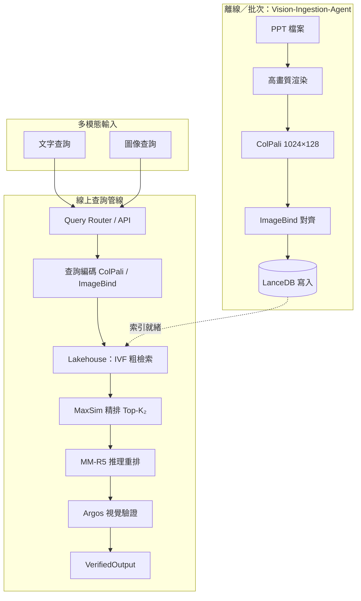
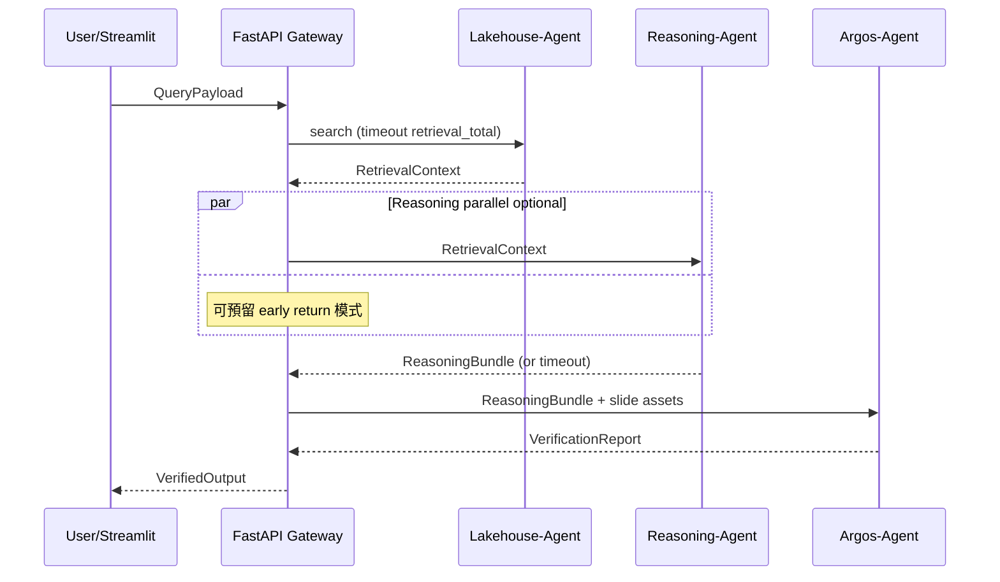

# 系統規格書（Source of Truth）

> **文件角色**：本文件為「次世代多模態 PPT 視覺與推理檢索系統」在 Cursor 內開發之**單一事實來源（SSOT）**。  
> **對齊基準**：`openspec/agents.md`（四代理 MAS 架構）、`openspec/project.md`（專案總覽）。  
> **版本**：1.1 · **日期**：2026-05-03（補強：多向量展平 reshape、ColPali／ImageBind 路由、Argos Claims 解析）

---

## 1. 系統資料流（端到端查詢生命週期）

### 1.1 生命週期總覽

查詢自多模態輸入（文字／圖像／混合）進入系統後，依序經過 **Lakehouse → Reasoning-Reranker → Argos** 三階段線性管線（**Vision-Ingestion** 僅在**索引／ingest** 新路徑時觸發，不阻塞線上查詢）。最終輸出為**已驗證、可審計**的排序結果與證據地圖。

| 階段 | 觸發條件 | 輸入契約 | 輸出契約 |
|------|----------|----------|----------|
| **Vision-Ingestion** | 批次 ingest 新 PPT | 檔案路徑、渲染參數 | `VisualFeatureBundle`（寫入 LanceDB） |
| **Lakehouse-Retrieval** | 每次使用者查詢 | `QueryPayload` | `RetrievalContext` |
| **Reasoning-Reranker** | 每次查詢（可逾時降級） | `RetrievalContext` | `ReasoningBundle` |
| **Argos-Verification** | 每次查詢（可逾時降級） | `ReasoningBundle` + 原始投影片圖像／多向量 | `VerifiedOutput`（含 `VerificationReport`） |

### 1.2 查詢路徑資料流（Mermaid）



> **實作註記**：圖中 `ENC` 在程式中應依 **§2.3.1** **分路**為 ColPali 與 ImageBind 編碼；**僅 ColPali 分支**可接續 **MaxSim**；ImageBind 分支僅能驅動 **單向量 ANN**（如 `imagebind_vec`），兩者分數若融合須在**分數層**加權，不得混用 patch 內積。

### 1.3 單次查詢逐步驟語意

1. **查詢特徵化**：依 **§2.3.1 檢索路由** 選定空間——**ColPali 查詢向量 `(Q,128)`** 與 **ImageBind 查詢向量 `(1024,)`** 物理上不在同一嵌入空間，不可混用於同一距離或 MaxSim 式子（見 §2.3.1）。
2. **第一階段（粗檢索）**：LanceDB IVF／量化索引召回 Top-K₁（建議 K₁∈[100,500]），目標延遲 **< 50ms**（`agents.md` §2.5）。
3. **第二階段（MaxSim）**：對候選載入完整 `1024×128` 文件多向量，執行 Late Interaction，輸出 Top-K₂（建議 K₂∈[10,20]），目標 **< 100ms**；**端到端檢索 < 200ms**。
4. **推理重排**：MM-R5 對 K₂ 候選生成 CoT 與信度，計算 `reranked_score`；單候選目標 **1–3s**（可並行，見第 5 節）。
5. **Argos 驗證**：解析 claims → 視覺 grounding → 幻覺風險與降權；單張目標 **500–1000ms**，證據地圖生成 **< 200ms**。
6. **回應**：回傳 `VerifiedOutput`，含審計軌跡、證據區域、調整後分數與風險標籤。

---

## 2. 元件介面定義（Pydantic／張量契約）

### 2.1 共用型別與列舉

```python
from __future__ import annotations

from datetime import datetime
from enum import Enum
from typing import Any, Literal, Optional

from pydantic import BaseModel, Field, field_validator


class Modality(str, Enum):
    TEXT = "text"
    IMAGE = "image"
    MULTIMODAL = "multimodal"


class VerificationStatus(str, Enum):
    PASS = "pass"
    WARN = "warn"
    FAIL = "fail"
    UNKNOWN = "unknown"  # 驗證逾時或跳過時使用


class RiskLevel(str, Enum):
    LOW = "low"
    MEDIUM = "medium"
    HIGH = "high"
```

### 2.2 `QueryPayload`（進入檢索／協調層）

```python
class QueryPayload(BaseModel):
    """使用者查詢標準載荷（API / 代理間第一棒）。"""

    request_id: str = Field(..., description="全鏈路追蹤 ID")
    query_text: Optional[str] = None
    query_image_bytes: Optional[bytes] = None
    query_image_mime: Optional[str] = Field(default=None, description="例如 image/png")
    modality: Modality
    top_k_filter: int = Field(500, ge=10, le=2000, description="K₁ 粗檢索")
    top_k_maxsim: int = Field(20, ge=1, le=50, description="K₂ 精排輸出")
    locale: str = Field("zh-TW", description="提示詞與 UI 語系提示")
    user_preferences: dict[str, Any] = Field(default_factory=dict)
    timeout_ms: dict[str, int] = Field(
        default_factory=lambda: {
            "retrieval_total": 200,
            "reasoning_per_candidate": 8000,
            "reasoning_batch": 120000,
            "verification_per_slide": 1500,
        }
    )

    @field_validator("query_text")
    @classmethod
    def text_or_image(cls, v: Optional[str], info):
        modality = info.data.get("modality")
        has_img = info.data.get("query_image_bytes")
        if modality == Modality.TEXT and not v:
            raise ValueError("TEXT 模式需提供 query_text")
        if modality == Modality.IMAGE and not has_img:
            raise ValueError("IMAGE 模式需提供 query_image_bytes")
        return v
```

### 2.3 張量與多向量中繼資料（ColPali／ImageBind）

**ColPali（文件／投影片側，與 `agents.md` §1.2.3 一致）**

| 欄位 | 規格 | 說明 |
|------|------|------|
| `multi_vectors` | `float32`，形狀 **`(1024, 128)`**（記憶體／MaxSim）；Lance 持久化見 **§3.1.1** | 32×32 patch 網格；**展平順序**以 §3.1.1 C contiguous 為準 |
| `patch_grid` | `(32, 32)` 隱含 | patch 索引 `p = y * 32 + x`（需在 metadata 中固定約定） |
| `patch_coordinates` | 長度 1024 的像素／正規化座標 | 每 patch 對應原圖 ROI，供證據地圖 |
| `dtype` | `float32` | 禁止混用 float16 於 MaxSim 核心路徑除非另有校準章節 |

**查詢側 ColPali 多向量**

- 文字查詢經 ColPali query encoder：形狀 **`(Q, 128)`**，其中 **`Q` 為可變長度**（模型定義之 query token patches）；MaxSim 公式與 `agents.md` §2.2.3 一致。
- 圖像查詢：與文件側相同邏輯產生 **`(Q, 128)`**。

**ImageBind（對齊層，`agents.md` §1.2.4／專案 1024-dim 要求）**

| 角色 | 向量形狀 | 後設資料 |
|------|-----------|----------|
| 文字模態 | **`(1024,)`** `float32` | `modality="vision"` 對應之 IB 版本需記錄於 `model_revision` |
| 圖像模態 | **`(1024,)`** | 輸入解析度、歸一化參數 |
| 獨立 ImageBind 編碼（**非** ColPali 空間） | **`(1024,)`** | 與 ColPali **分路儲存／分路檢索**；見 §2.3.1 |

> **已廢止之模糊表述**：規格不再使用「從 ColPali 匯入 ImageBind」作為預設假設；若日後實作**可學習對齊投影頭**，須獨立版本化欄位（例如 `colpali_to_ib_projected`）並經離線校準驗證，**未驗證前不得啟用**。

> **相容註記**：若部署之 ImageBind 變體為 **512-dim**，僅允許以**獨立欄位** `imagebind_512` 寫入；預設 SLA 路徑以 **1024-dim** 為準（`project.md` 技術棧）。

#### 2.3.1 ColPali 與 ImageBind：空間不互通與 Lakehouse 路由（Critical）

ColPali 視覺／查詢嵌入源自 **SigLIP／PaliGemma** 系族所定義的空間；ImageBind 則為**獨立的多模態投影空間**。兩者在幾何上**不可假設對齊**，亦**不可**將一方向量直接代入另一方之相似度或 Late Interaction 公式。

**Lakehouse-Retrieval-Agent 強制規則**：

| 查詢編碼來源 | 允許比對之索引欄位 | MaxSim（ColPali Late Interaction） |
|----------------|-------------------|-------------------------------------|
| **ColPali** 文字／圖像 query encoder | `colpali_multi`（文件側 `(1024,128)`） | **允許**：查詢 `(Q,128)` × 文件 `(1024,128)` |
| **ImageBind** 文字／圖像 encoder | `imagebind_vec`（文件側 `(1024,)`） | **禁止**：不得將 ImageBind 向量代入 MaxSim；僅能做 ANN／cosine 等**單向量**檢索 |

- **文字查詢**在實作上必須**明確選路**：要麼走 **ColPali 文字編碼 → ColPali 索引 + MaxSim**，要麼走 **ImageBind 文字編碼 → ImageBind 索引（無 MaxSim）**。預設產品路徑若需 Late Interaction 與 `agents.md` 一致之雙階段檢索，應以 **ColPali 為主幹**；ImageBind 可作**平行副路**（例如跨模態後備或混合融合中的獨立分支），但融合時僅允許**分數級**加權（如 `agents.md` §2.2.4），**禁止**在數學上把 ImageBind 內積當成 ColPali patch 相似度。

- **圖像查詢**同樣遵守上表：ColPali 圖編碼走 MaxSim；ImageBind 圖編碼只走 `imagebind_vec` 檢索。

### 2.4 `RetrievalContext`（Lakehouse → Reasoning）

```python
class EvidencePatch(BaseModel):
    patch_index: int = Field(..., ge=0, le=1023)
    score: float
    bbox_norm: tuple[float, float, float, float] = Field(
        ..., description="x0,y0,x1,y1 相對原圖 0–1"
    )


class RetrievalCandidate(BaseModel):
    slide_id: str
    page_index: int
    maxsim_score: float = Field(..., ge=0.0, le=1.0)
    evidence_patches: list[EvidencePatch]
    retrieval_stage: Literal["filtering", "maxsim", "hybrid"] = "maxsim"
    metadata: dict[str, Any] = Field(default_factory=dict)


class RetrievalMetrics(BaseModel):
    total_latency_ms: float
    filter_stage_latency_ms: float
    maxsim_stage_latency_ms: float
    candidates_examined: int
    recall_at_10: Optional[float] = None
    mrr: Optional[float] = None


class RetrievalContext(BaseModel):
    """Lakehouse-Retrieval-Agent 輸出；Reasoning-Reranker 輸入。"""

    request_id: str
    query: QueryPayload
    candidates: list[RetrievalCandidate]
    metrics: RetrievalMetrics
    query_colpali: Optional[list[list[float]]] = Field(
        None, description="序列化 (Q,128)，可選避免重算"
    )
    query_imagebind: Optional[list[float]] = Field(
        None, description="長度 1024；與索引欄位一致"
    )
```

### 2.5 `ReasoningBundle`（Reasoning → Argos）

```python
class ReasoningStep(BaseModel):
    step_id: int
    step_name: str
    reasoning_text: str
    local_score: float = Field(..., ge=0.0, le=1.0)
    confidence: float = Field(..., ge=0.0, le=1.0)


class RankedCandidate(BaseModel):
    slide_id: str
    original_rank: int
    reranked_score: float = Field(..., ge=0.0, le=1.0)
    retrieval_score: float
    reasoning_score: float
    completeness_score: float = Field(0.0, ge=0.0, le=1.0)
    inference_text: str
    reasoning_steps: list[ReasoningStep]
    confidence_level: Literal["high", "medium", "low"]
    key_evidence_phrases: list[str]
    fallback_retrieval_only: bool = False


class ReasoningBundle(BaseModel):
    request_id: str
    ranking: list[RankedCandidate]
    reasoning_model_revision: str
    audit: dict[str, Any] = Field(default_factory=dict)
```

### 2.6 `VerificationReport` 與 `VerifiedOutput`（Argos → 前端／API）

```python
class EvidenceRegion(BaseModel):
    patch_coords: tuple[int, int, int, int] = Field(
        ..., description="patch 網格 tl_x, tl_y, br_x, br_y（含邊界約定）"
    )
    bbox_norm: tuple[float, float, float, float]
    region_type: Literal["text", "chart", "image", "other"]
    referenced_claim: str
    confidence: float = Field(..., ge=0.0, le=1.0)


class VerifiedCandidate(BaseModel):
    slide_id: str
    original_reranked_score: float
    adjusted_score: float = Field(..., ge=0.0, le=1.0)
    verification_status: VerificationStatus
    hallucination_risk_score: float = Field(..., ge=0.0, le=1.0)
    hallucination_risk_level: RiskLevel
    evidence_coverage_ratio: float = Field(..., ge=0.0, le=1.0)
    semantic_consistency: float = Field(..., ge=0.0, le=1.0)
    verified_claims: list[str]
    unverified_claims: list[str]
    evidence_regions: list[EvidenceRegion]
    evidence_map_asset_id: Optional[str] = Field(
        None, description="物件儲存或本地快取鍵，供 Streamlit 載入"
    )


class VerificationReport(BaseModel):
    verification_id: str
    request_id: str
    generated_at: datetime
    per_slide: list[VerifiedCandidate]
    audit_trail: dict[str, Any]
    summary: dict[str, Any] = Field(
        default_factory=dict,
        description="如 pass/warn/fail 計數、平均風險",
    )


class VerifiedOutput(BaseModel):
    """對使用者／Streamlit 的最終契約。"""

    request_id: str
    query: QueryPayload
    retrieval: RetrievalContext
    reasoning: ReasoningBundle
    verification: VerificationReport
    total_latency_ms: float
    degradation_flags: list[str] = Field(
        default_factory=list,
        description="例如 reasoning_timeout, verification_timeout",
    )
```

---

## 3. LanceDB 資料表設計（多向量與索引）

### 3.1 設計原則

- **一筆投影片一列（row）**：與 MaxSim 需一次讀取整張 slide 的 `1024×128` 一致；避免 1024 列 join。
- **第一階段 IVF-PQ**：對**低維匯總向量**建索引（見 §3.3），而非對完整 131072 維展開做 PQ。

#### 3.1.1 多向量展平儲存與 Reshape 規則（Critical／實作建議）

**建議採用單一欄位展平**：Lance 層使用 **`fixed_size_list(float, 131072)`**（即 `1024 × 128`）儲存 ColPali 多向量；相較巢狀 `List<List<float>>`，單一固定長度 list 在列式 I/O、壓縮與讀取路徑上通常**更連續、更少 shape 歧義**。

**展平順序（全系統強制一致）**：以邏輯張量 **`float32[C]`** 形狀 `(1024, 128)` 之 **C contiguous（列主序）** 為準——先排滿 **patch 索引 0** 的 128 維，再 patch 1…1023。寫入 Lance 前 `vec.flatten()`；讀出後**立即**還原為 MaxSim 可用形狀。

```python
import numpy as np

COLPALI_FLAT_LEN = 1024 * 128  # 131072


def colpali_to_lance_flat(multi: np.ndarray) -> np.ndarray:
    """(1024, 128) float32 -> (131072,) 寫入 Lance 前校驗。"""
    if multi.shape != (1024, 128):
        raise ValueError(f"expected (1024, 128), got {multi.shape}")
    return np.ascontiguousarray(multi, dtype=np.float32).ravel()


def lance_flat_to_colpali(flat: np.ndarray) -> np.ndarray:
    """從 Lance 讀出後立即 reshape，供 MaxSim 使用。"""
    if flat.shape != (COLPALI_FLAT_LEN,):
        raise ValueError(f"expected ({COLPALI_FLAT_LEN},), got {flat.shape}")
    return flat.reshape(1024, 128)
```

**禁止**：在應用層長期以「未 reshape 的 131072 向量」參與運算；**允許**：傳輸／快取層僅傳 flat，邊界上單點 `reshape`。

> **與 §3.2 對齊**：邏輯欄位名仍稱 `colpali_multi`，實體型別為 **長度 131072 的 fixed_size_list**；文件與程式註解應標註 `flat_dim=131072`。

### 3.2 建議 Schema（邏輯欄位）

| 欄位 | 型別（邏輯） | 說明 |
|------|----------------|------|
| `slide_id` | `string` | 主鍵 |
| `deck_id` | `string` | 簡報檔層級 |
| `page_index` | `int32` | 與 `agents.md` 一致 |
| `source_path` | `string` | 可追溯路徑 |
| `created_at` | `timestamp` | 索引時間 |
| `colpali_multi` | **`fixed_size_list(float, 131072)`**（**建議**；見 §3.1.1） | **核心多向量**；讀後 `reshape(1024, 128)` |
| `colpali_agg_128` | `fixed_size_list(float, 128)` | patch-mean 或 CLS 式彙總，供粗檢索 |
| `imagebind_vec` | `fixed_size_list(float, 1024)` | 跨模態檢索／路由 |
| `patch_bboxes` | `fixed_size_list(fixed_size_list(float, 4), 1024)` | 可選，加速證據地圖 |
| `fts_text` | `string` | 由 OCR／VLM 產生之可檢索摘要 |
| `quality_metrics` | `struct` / `string` JSON | 覆蓋率等 |

### 3.3 1024 向量效率：IVF-PQ 與存取模式

1. **粗檢索（<50ms）**  
   - 在 **`colpali_agg_128` 或 `imagebind_vec`** 上建 **IVF_PQ**（或 Lance 支援之 IVF+PQ 組合）。  
   - PQ 子向量數與 `nlist` 依資料量調參；百萬 slide 級需**分片**（`agents.md` §2.2.1）。

2. **MaxSim 精排**  
   - 對 Top-K₁ 候選 **批次讀取** `colpali_multi`；計算在 GPU 上以 `(Q,128) @ (1024,128).T` 向量化完成（`agents.md` §2.2.3）。

3. **展平欄位讀寫**  
   - 寫入：`colpali_multi` 以 **131072** 維 flat 落地；讀出後依 §3.1.1 **立即** `reshape(1024, 128)` 再送 MaxSim，避免 silent shape bug。

4. **與 ImageBind 並存（再述 §2.3.1）**  
   - 粗檢索可對 `imagebind_vec` 做 IVF-PQ；MaxSim **僅**使用 **ColPali** 查詢 `(Q,128)` 與 **`colpali_multi` reshape 後**之文件多向量。  
   - **嚴禁**將 `imagebind_vec` 或 ImageBind 查詢嵌入代入 MaxSim 或與 `colpali_multi` patch 做逐塊內積。

---

## 4. 代理協調與非同步執行

### 4.1 執行模型選型

| 機制 | 適用場景 | 說明 |
|------|-----------|------|
| **FastAPI + `asyncio`** | 檢索子請求 I/O、並行 await 多候選 | 低延遲 API；MaxSim／小模型可線程池 |
| **FastAPI `BackgroundTasks`** | 查詢後非關鍵寫日誌、异步生成證據圖 | **不得**將必須阻塞回應的 Reasoning／Verification 全量放 Background 而無 job id |
| **Celery / RQ** | MM-R5 7B 與 Argos 重載、多 GPU 佇列 | 查詢回傳 `job_id`，Streamlit 輪詢／SSE |
| **Temporal** | 需**可重試狀態機**、長流程審計、saga | ingest 全檔、跨日重試、人審節點 |

**建議預設**：線上 **同步路徑** 在單請求內完成 Retrieval（<200ms）+ 可選 **並行** Reasoning／Verification；若單請求預算超過 **~6–15s**，改 **Celery + job 狀態 API**（對齊 `agents.md` 監控示例總延遲 ~5.5s 量級）。

### 4.2 協調流程（Mermaid）



### 4.3 Fallthrough／Fallback（逾時與失敗）

與 `agents.md` §5.2 **一致並細化**：

**A. Reasoning-Reranker-Agent 逾時**

- **觸發**：單候選超過 `timeout_ms.reasoning_per_candidate` 或批次超過 `reasoning_batch`。
- **行為**：  
  1. 取消未完成的 MM-R5 呼叫（最佳努力）。  
  2. 對未完成候選：`fallback_retrieval_only=True`，`reranked_score = retrieval_score`（MaxSim 分數），`inference_text` 置為固定模板：「推理逾時，已降級為檢索分排序」。  
  3. `degradation_flags` 追加 `reasoning_timeout`。  
  4. 整體排序：已推理候選依原 `reranked_score`；未推理依 `retrieval_score`，**不相混用未校準分數**時可二段排序（先標記組內排序）。

**B. Argos-Verification-Agent 逾時**

- **觸發**：單張超過 `verification_per_slide`。
- **行為**：  
  1. `verification_status = UNKNOWN`。  
  2. `hallucination_risk_score` 設為 **保守預設 0.25**（中風險），或按產品策略設 **0.15** 邊界；**必須**在 `audit_trail` 標記 `verification_timeout`。  
  3. **降權**：`adjusted_score = original_reranked_score * (1 - 0.15)`（固定折扣）**或**套用 §5.2 公式時將 `risk` 下限設為 0.15。  
  4. 不阻斷回應；使用者 UI 顯示「未驗證」徽章。

**C. Lakehouse 失敗**

- 依 `agents.md`：切換副本索引；無副本則 **503** 與結構化錯誤碼，**禁止**靜默空結果。

**D. 全系統熔斷**

- 錯誤率 >10% 或延遲 >2s（檢索段）：啟動熔斷，僅回傳快路徑（如純 ImageBind Top-K）並標記 `degradation_flags`。

---

## 5. MM-R5 與 Argos 整合

### 5.1 MM-R5 提示模板（Reasoning-Reranker）

**系統提示（System）— 建議固定中文版（`locale=zh-TW`）**

```text
你是企業簡報檢索系統的「多模態推理重排器」。你只能根據使用者查詢與下列輸入中的投影片視覺描述／結構化元素進行推理；不得捏造投影片中不存在的圖表、數字或標題。
請依序輸出五個段落，對應步驟：視覺感知、查詢解析、語義對齊、深層推理、信度評估。
最後給出一行 JSON：{"reasoning_score":0-1,"completeness_score":0-1,"confidence_level":"high|medium|low"}。
```

**使用者提示（User）— 模板**

```text
【使用者查詢】
{query_text}

【候選投影片】
slide_id: {slide_id}
page_index: {page_index}
MaxSim 檢索分數: {maxsim_score:.4f}

【投影片內容摘要】
{slide_visual_caption_or_ocr}

請依照系統指示完成五步驟推理，並嚴格標註每一步所依據的視覺證據（元素名稱與位置：上/下/左/右/標題區/圖表區）。不得引用未出現在「投影片內容摘要」中的具體文字或數值。
```

> **實作要求**：`slide_visual_caption_or_ocr` 必須來自實際 ingest 管線（VLM caption／OCR），與 Argos 所用圖像一致，以降低跨模態漂移。

#### 5.1.1 MM-R5 輸出解析與 Claims 管線：Reasoning-Parser、Claim-Normalizer（Critical）

§5.1 要求 MM-R5 在敘述末輸出一行 **JSON**（`reasoning_score`、`completeness_score`、`confidence_level`）。實務上模型仍可能輸出**多餘後綴、Markdown 碼框、或殘缺 JSON**。**Lakehouse／Argos 不得**直接 `json.loads` 全段輸出而不經解析層。

**Reasoning-Parser（建議置於 Reasoning-Reranker 與 Argos 之間，或 Argos 入口）**

- 從 `inference_text` 中**穩健抽取**最後一個 JSON object（正則／括號平衡／修復尾部逗號等防禦性策略）。  
- 驗證欄位型別與範圍；失敗時寫入 `audit_trail.reasoning_parse_status`，並以**預設信度**或僅檢索分降級（與 §4.3 推理逾時策略對齊）。  
- 將五步驟敘述與 JSON 分離，供 UI 與審計分欄儲存。

**Claim-Normalizer（建議為 Argos-Agent 內建模組）**

- **輸入**：Reasoning-Parser 產出之結構化片段、`key_evidence_phrases`、各 `ReasoningStep.reasoning_text` 中**可被驗證的視覺聲明**（claims）。  
- **任務**：將「模糊視覺描述」（例如「左側文字區」「標題附近」「圖表顯示下降」）對應到 **可執行 grounding 的規格**，包括：  
  - **區域類型**：`title | body | chart | image | slide`（與 `agents.md` §4.2.1 區域分類一致）；  
  - **空間提示**：`top_center`、`left_third` 等**離散槽位**，或 32×32 patch 之**粗略 ROI**（允許寬鬆 bbox 供 OCR／VLM 再精化）；  
  - **文字錨點**：若 claim 含專有名詞／數字，填入 `expected_substrings` 供 OCR 比對；  
  - **極性／關係**：如「上升／下降」需對應到圖表區檢測子任務，避免與純文字搜尋混淆。  
- **輸出**：`NormalizedClaim` 列表（建議 Pydantic：`claim_id`、`canonical_text`、`region_hints`、`expected_substrings`、`patch_prior: Optional[tuple]`），作為 Argos **Spatial Grounding** 與覆蓋度 \(c\) 的**唯一依據**；原始自然語句保留於 `audit_trail` 以供人讀。

> **與 §5.4 銜接**：Argos 輸入除 `inference_text` 外，**建議強制**傳入 `NormalizedClaim[]`，以降低「推理很長但無可驗證錨點」造成的假覆蓋。

```python
from typing import Literal, Optional

from pydantic import BaseModel, Field


class NormalizedClaim(BaseModel):
    """Claim-Normalizer 輸出；供 Argos Spatial Grounding 使用。"""

    claim_id: str
    canonical_text: str
    region_type: Literal["title", "body", "chart", "image", "other", "slide"]
    spatial_hints: list[str] = Field(
        default_factory=list,
        description="離散槽位，如 top_center, left_third",
    )
    expected_substrings: list[str] = Field(default_factory=list)
    patch_prior_bbox: Optional[tuple[int, int, int, int]] = Field(
        None, description="32×32 網格上之粗 ROI，可選",
    )
```

### 5.2 重排分數（與 `agents.md` §3.2.3 對齊）

\[
s_{\text{final}} = \lambda_1 \, s_{\text{retrieval}} + \lambda_2 \, s_{\text{reasoning}} + \lambda_3 \, s_{\text{completeness}}, \quad \sum \lambda_i = 1
\]

預設 \((\lambda_1,\lambda_2,\lambda_3) = (0.4, 0.4, 0.2)\)。動態權重規則沿用 `agents.md`（多概念查詢提高 \(\lambda_2\) 等）。

### 5.3 幻覺風險分數（Hallucination Risk）與降權

與 `agents.md` §4.2.2 **數學一致**：

\[
r = w_1 (1 - c) + w_2 (1 - s) + w_3 \frac{u}{n}
\]

- \(c\)：`evidence_coverage_ratio` ∈ [0,1]  
- \(s\)：`semantic_consistency` ∈ [0,1]  
- \(u\)：無視覺引用的 claims 數；\(n\)：總 claims 數（\(n=0\) 時定義 \(u/n=0\) 並記錄警告）  
- 預設 \((w_1,w_2,w_3) = (0.4, 0.35, 0.25)\)

**風險分級**（與 `agents.md` 一致）：

- \(r < 0.15\) → low  
- \(0.15 \le r < 0.45\) → medium  
- \(r \ge 0.45\) → high  

**降權（Down-weighting）**

\[
s_{\text{adj}} = s_{\text{orig}} \cdot \bigl(1 - r^{0.5}\bigr)
\]

其中 \(s_{\text{orig}}\) 為驗證前之 `reranked_score`（或明確註明為 `original_reranked_score`）。高風險時可再加碼：**從 Top-K 剔除或標記人工審查**（`agents.md` §4.3 Task 6）。

### 5.4 Argos 與 MM-R5 的資料契約

- Argos 輸入必須包含：`ReasoningBundle.ranking[].inference_text`、`key_evidence_phrases`、原始 slide 圖像、`colpali_multi`（或 §3.1.1 讀出 reshape 後之 `(1024,128)`）或 `patch_bboxes`。  
- **建議必填**：§5.1.1 之 **`NormalizedClaim` 列表**（由 Claim-Normalizer 產生），以便一致計算 \(u,n\) 與證據覆蓋率。  
- Argos 輸出之 `EvidenceRegion.patch_coords` 應與 Vision-Ingestion 之 32×32 網格同一約定，供前端映射（第 7 節）。

---

## 6. 效能與硬體約束

### 6.1 子模組延遲 SLA（摘自 `agents.md`，P95 目標）

| 子模組 | 指標 | 目標 |
|--------|------|------|
| Vision 單頁渲染 | 延遲 | **< 500ms** |
| ColPali 單頁特徵 | 延遲 | **< 2s** |
| ImageBind 對齊 | 延遲 | **< 300ms** |
| Lakehouse 第一階段 | 延遲 | **< 50ms** |
| Lakehouse MaxSim 第二階段 | 延遲 | **< 100ms** |
| Lakehouse 端到端 | 延遲 | **< 200ms** |
| MM-R5 單候選 | 延遲 | **1–3s** |
| Argos 單張驗證 | 延遲 | **500–1000ms** |
| 證據地圖生成 | 延遲 | **< 200ms** |

### 6.2 VRAM：ColPali（ViT）與 MM-R5（7B）同時佔用策略

1. **程序隔離（推薦）**：Retrieval／ColPali 服務與 MM-R5 服務分屬不同進程；單卡透過 **時間分片** 或 **MIG** 分割；避免單進程同載兩套大模型。  
2. **序列化載入**：同一 worker 需兩者時，使用 **lazy load + torch.cuda.empty_cache()** 於階段切換；推論間 **梯度關閉、`inference_mode`**。  
3. **量化**：MM-R5 優先 **4-bit NF4／8-bit**（Transformers bitsandbytes）；ColPali 維持 fp16 視 VRAM 而定。  
4. **MaxSim 外置**：MaxSim 大量矩陣乘算可放 **同一 GPU stream** 與 ColPali 查詢向量重用，避免重複 host↔device。  
5. **併發上限**：以 **佇列深度** 限制同時 7B 推理數（通常每卡 1–2 路），防止 OOM。  

---

## 7. 前端需求（Streamlit）：證據地圖（Evidence Map）

### 7.1 UI 元件

1. **側欄**：查詢輸入、模態選擇、Top-K、進階逾時／降級開關顯示（只讀或可調）。  
2. **結果列表**：每列 `adjusted_score`、`verification_status` 徽章、`hallucination_risk_level` 色彩編碼（綠／黃／紅，對齊 `agents.md` §4.2.4）。  
3. **證據地圖主視圖**：  
   - 底圖：`st.image` 顯示原始 slide PNG。  
   - **疊加層**：使用 `PIL.ImageDraw` 在 **與底圖相同尺寸** 的 RGBA 覆蓋層上繪製半透明矩形；`alpha` 建議 40–80。  
4. **圖例**：綠／黃／紅對應 confidence >0.9、0.7–0.9、≤0.7（`agents.md` §4.2.4）。  
5. **步驟對應**：側邊或下方 `st.expander` 列出 `ReasoningStep`，點選時高亮對應 `EvidenceRegion`（session_state 驅動）。

### 7.2 座標變換（patch → 像素 bbox）

對每個 `EvidenceRegion.patch_coords = (tl_x, tl_y, br_x, br_y)`（**32×32 網格索引**）：

```python
def patch_grid_to_pixel_bbox(
    tl_x: int, tl_y: int, br_x: int, br_y: int,
    img_w: int, img_h: int, grid: int = 32
) -> tuple[int, int, int, int]:
    cell_w = img_w / grid
    cell_h = img_h / grid
    x0 = int(tl_x * cell_w)
    y0 = int(tl_y * cell_h)
    x1 = int((br_x + 1) * cell_w)  # 邊界約定：br 為含入最後 patch
    y1 = int((br_y + 1) * cell_h)
    return x0, y0, min(x1, img_w), min(y1, img_h)
```

若使用 `bbox_norm`（0–1），則直接乘以 `img_w`、`img_h` 繪製，**以後端／ingest 產生之 norm 定義為準**，並與 patch 網格互驗。

### 7.3 效能與快取

- 證據地圖靜態資產：`evidence_map_asset_id` 對應快取檔案，避免每次重畫；**<200ms** 目標（`agents.md` §4.5）。  
- `st.cache_data` 快取依 `slide_id + verification_id` 之合成鍵。

---

## 8. 追溯矩陣（本規格 ↔ `agents.md`）

| 本規格章節 | `agents.md` 章節 |
|------------|------------------|
| §1 資料流 | §2.3, §3.3, §4.3, §5.1 |
| §2 介面 | §1.4, §2.4, §3.4, §4.4 |
| §3 LanceDB | §2.2.1–2.2.4 |
| §4 協調 | §5.1–5.2 |
| §5 MM-R5/Argos（含 §5.1.1 Parser／Normalizer） | §3.2, §4.2 |
| §2.3.1 ColPali／ImageBind 路由 | §2.2.4, `project.md` 混合檢索 |
| §3.1.1 展平 reshape | §1.2.3, §2.2.3 |
| §6 效能 | §1.5, §2.5, §3.5, §4.5 |
| §7 Streamlit | §4.2.4, `project.md` §4 Phase 4 |

---

**文件結束**
